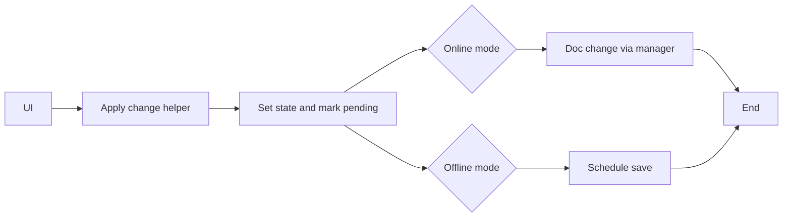

# 1. 问题

当前 `src/store/resume/form.ts` 的多个更新方法中重复实现了“离线/在线分支判断 + 设为 pendingChanges + 触发持久化”的流程，缺少统一抽象，导致重复代码与不一致风险升高。涉及到的主要方法包括 `updateForm`、`updateOrder`、`changeType`、`toggleVisibility`、`setVisibility`（约 125-237 行）。

## 1.1. **重复的离线/在线分支与持久化触发**
- 位置：`src/store/resume/form.ts` 125-150（`updateForm`）、152-166（`updateOrder`）、168-182（`changeType`）、184-209（`toggleVisibility`）、213-237（`setVisibility`）。
- 现象：每个方法都包含以下相似逻辑：
  - 读取 `resumeId` 与 `mode` 判断离线/在线。
  - `set(...)` 更新本地状态并将 `pendingChanges: true`。
  - 离线分支：`scheduleOfflinePersist(() => get().syncToSupabase())`。
  - 在线分支：`state.docManager?.change(...)` 写入 Automerge 文档。
- 代表性代码（节选）：
```ts
// updateForm（125-150）
if (!resumeId || state.mode === 'offline' || isOfflineResumeId(resumeId)) {
  set(prev => ({ [key]: { ...prev[key], ...sanitized }, pendingChanges: true }))
  scheduleOfflinePersist(() => get().syncToSupabase())
  return
}
set(prev => ({ [key]: { ...prev[key], ...sanitized }, pendingChanges: true }))
state.docManager?.change((doc) => {
  if (!doc[key]) { doc[key] = {} as any }
  applyPatch(doc[key], sanitized)
})
```
```ts
// changeType（168-182）
if (!resumeId || state.mode === 'offline' || isOfflineResumeId(resumeId)) {
  set({ type, pendingChanges: true })
  scheduleOfflinePersist(() => get().syncToSupabase())
  return
}
set({ type, pendingChanges: true })
state.docManager?.change((doc) => { doc.type = type })
```
```ts
// toggleVisibility（184-209）
if (!resumeId || state.mode === 'offline' || isOfflineResumeId(resumeId)) {
  set(prev => ({ visibility: { ...prev.visibility, [id]: nextValue }, pendingChanges: true }))
  scheduleOfflinePersist(() => get().syncToSupabase())
  return
}
set(prev => ({ visibility: { ...prev.visibility, [id]: nextValue }, pendingChanges: true }))
state.docManager?.change((doc) => {
  if (!doc.visibility) { doc.visibility = {} as any }
  doc.visibility[id] = nextValue
})
```
- 问题：
  - 重复代码增多，未来若离线/在线判断或持久化策略变化，需要在多处同步修改，容易遗漏。
  - 不同方法对文档字段初始化的写法也各自为政，潜在不一致。

## 1.2. **状态更新与文档变更缺少“事务感”**
- 现象：每个方法都自己完成状态更新与文档变更，流程散落，无法通过一个统一的入口施加额外策略（如节流、批处理、扩展审计记录等）。
- 问题：难以在一个地方增强“应用更改并触发保存”的整体策略，也不便于单元测试该流程。

## 1.3. **细节不一致风险与测试成本上升**
- 现象：如对 `doc.visibility` 的初始化在不同方法中重复出现；`applyPatch` 和字段存在性检查的使用分布各异。
- 问题：细节实现容易漂移，测试需要覆盖重复路径，增加维护与回归成本。

# 2. 收益

一句话总结：收敛为统一的“应用更改并触发保存”辅助函数，将重复逻辑集中管理，降低复杂度与不一致风险。

## 2.1. **降低复杂度**
- 5 个方法共享的分支与持久化触发逻辑被提炼到一个内部助手中。
- 预计各方法的圈复杂度可从原来的 **6-9** 降至 **3-4**。

## 2.2. **提升一致性与可维护性**
- 离线/在线判断与保存策略集中于一个函数，未来策略调整只需改一处。
- 字段初始化与补丁应用统一，行为更稳定。

## 2.3. **增强可测试性**
- 辅助函数可单独编写单元测试，覆盖“状态更新 + 文档变更 + 保存触发”的主路径。
- 其他方法只需校验自身参数与特定字段更新是否正确传递给助手。

## 2.4. **便于扩展**
- 后续加入节流、批处理、审计、遥测等能力，只需在助手中演进，无需全项目多处改动。

# 3. 方案

总体思路：引入一个内部辅助函数，统一“应用更改、标记待保存、按离线/在线分支触发持久化”的流程，并复用现有的 `sanitizeDeep` 与 `applyPatch`。

## **3.1. 关键实现与改造步骤**

- 步骤：
  - 新增 `applyResumeChange` 辅助函数，收敛公共流程。
  - 提供 `ensureSection` 工具统一文档字段初始化。
  - 将 `updateForm`、`updateOrder`、`changeType`、`toggleVisibility`、`setVisibility` 改为调用该助手。

- 辅助函数示例实现：
```ts
function ensureSection<T extends keyof AutomergeResumeDocument>(doc: AutomergeResumeDocument, key: T) {
  if (!doc[key]) {
    // 保持类型安全的兜底初始化，必要时用默认对象
    (doc as any)[key] = ({} as any)
  }
}

function applyResumeChange(
  setState: (prev: ResumeState) => Partial<ResumeState>,
  updateDoc?: (doc: AutomergeResumeDocument) => void,
) {
  const state = get()
  const resumeId = state.currentResumeId ?? useCurrentResumeStore.getState().resumeId

  // 统一设置 pendingChanges，并应用状态更新
  set(prev => ({ ...setState(prev), pendingChanges: true }))

  // 离线：统一触发延迟保存
  if (!resumeId || state.mode === 'offline' || isOfflineResumeId(resumeId)) {
    scheduleOfflinePersist(() => get().syncToSupabase())
    return
  }

  // 在线：统一写入文档
  if (updateDoc) {
    state.docManager?.change((doc) => {
      updateDoc(doc)
    })
  }
}
```

- 方法改造示例（前后对比）：

原始 `updateForm`：
```ts
if (!resumeId || state.mode === 'offline' || isOfflineResumeId(resumeId)) {
  set(prev => ({ [key]: { ...prev[key], ...sanitized }, pendingChanges: true }))
  scheduleOfflinePersist(() => get().syncToSupabase())
  return
}
set(prev => ({ [key]: { ...prev[key], ...sanitized }, pendingChanges: true }))
state.docManager?.change((doc) => {
  if (!doc[key]) { doc[key] = {} as any }
  applyPatch(doc[key], sanitized)
})
```
改造后：
```ts
updateForm: (key, data) => {
  const sanitized = sanitizeDeep(data)
  applyResumeChange(
    prev => ({ [key]: { ...prev[key], ...sanitized } }),
    (doc) => { ensureSection(doc, key); applyPatch((doc as any)[key], sanitized) }
  )
}
```

原始 `changeType`：
```ts
set({ type, pendingChanges: true })
state.docManager?.change((doc) => { doc.type = type })
```
改造后：
```ts
changeType: (type) => {
  applyResumeChange(
    () => ({ type }),
    (doc) => { doc.type = type }
  )
}
```

原始 `toggleVisibility`/`setVisibility`：
```ts
set(prev => ({ visibility: { ...prev.visibility, [id]: nextValue }, pendingChanges: true }))
state.docManager?.change((doc) => {
  if (!doc.visibility) { doc.visibility = {} as any }
  doc.visibility[id] = nextValue
})
```
改造后：
```ts
toggleVisibility: (id) => {
  const nextValue = !get().visibility[id]
  applyResumeChange(
    prev => ({ visibility: { ...prev.visibility, [id]: nextValue } }),
    (doc) => { ensureSection(doc, 'visibility'); doc.visibility![id] = nextValue }
  )
},

setVisibility: (id, isHidden) => {
  applyResumeChange(
    prev => ({ visibility: { ...prev.visibility, [id]: isHidden } }),
    (doc) => { ensureSection(doc, 'visibility'); doc.visibility![id] = isHidden }
  )
}
```

- 辅助说明：
  - `applyResumeChange` 统一设置 `pendingChanges: true`，并在离线模式下集中调用 `scheduleOfflinePersist`。
  - 在线模式下，`docManager.change` 的调用点统一，便于后续增强（如批处理、节流等）。
  - `ensureSection` 保证目标字段存在，避免各处重复初始化逻辑。

## **3.2. 流程示意图**



说明：图示展示“调用助手统一应用更改”的流程。关键点是将离线触发保存与在线文档变更统一到一个路径上，便于管控与测试。

# 4. 回归范围

本次改造主要影响“在编辑器内变更任意表单字段或显示开关后，如何标记待保存并触发离线/在线持久化”的端到端行为。测试需从用户操作到持久化完成进行验证，覆盖离线与在线两种模式。

## 4.1. 主链路
- 离线编辑：
  - 前置：当前简历为离线，编辑多个字段与显示开关。
  - 步骤：连续编辑不同表单项，观察是否合并触发保存且无抖动；手动同步也可正确执行。
  - 期望：`pendingChanges` 在编辑后置为 true，延时保存执行成功，数据写入离线存储。
- 在线编辑：
  - 前置：当前简历为在线，打开编辑器。
  - 步骤：依次调用 `updateForm`、`updateOrder`、`changeType`、`toggleVisibility`、`setVisibility`。
  - 期望：状态与 Automerge 文档均更新；保存完成后 `pendingChanges` 复位，`lastSyncTime` 更新。

示例用例要点：
- 用例 1：编辑基础信息姓名字段，确认离线模式下延时保存生效。
- 用例 2：在线模式调整模块顺序，确认文档 `order` 更新并最终写入。
- 用例 3：切换模板类型为 `modern` 并保存，确认 UI 与文档保持一致。
- 用例 4：切换 `visibility` 项，确认两模式下均正确持久化。

## 4.2. 边界情况
- `resumeId` 为空：助手应仅更新本地状态，且在离线路径走延时保存。
- `docManager` 或 `docHandle` 暂不可用：在线路径下不会抛错，状态仍更新，但不做文档变更；保存时需确保错误处理与提示。
- 连续多次编辑：离线模式下延时保存应被重置与合并；在线模式下文档变更应按序生效。
- 字段初始化：`ensureSection` 统一保障文档字段存在，避免不同方法的初始化差异导致异常。
- 错误回滚与提示：保留原有错误处理路径（`syncError` 设置、`isSyncing` 状态恢复）。
