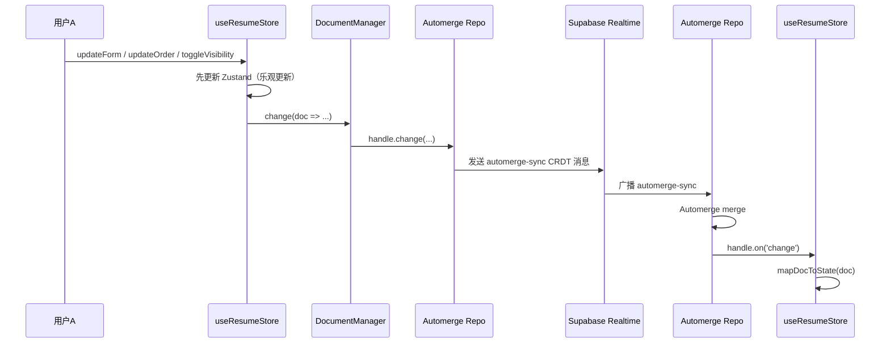
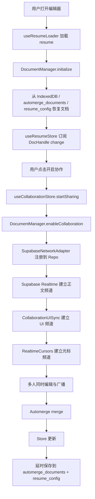

# 实时协作与 UI 同步系统说明

本文档说明这个项目是如何实现：

1. 多人同时编辑同一份简历内容
2. 编辑器 UI 状态的实时同步
3. 远程光标与点击反馈
4. 协作数据的持久化与恢复

本文基于当前代码实现，而不是泛泛而谈的协同编辑概念。

## 1. 先看整体分层

这个系统实际上分成 4 层：

### 1.1 会话层

负责“谁发起协作、谁加入、当前会话 ID 是什么、分享链接是什么、谁在线”。

核心文件：

- `src/store/collaboration/index.ts`
- `src/lib/collaboration/session-storage.ts`
- `src/pages/resume/editor/hooks/useCollaborationPanelValue.ts`

### 1.2 内容协作层

负责“简历正文如何多人同时编辑并自动合并”。

这里用的是：

- Zustand 维护本地表单状态
- Automerge 维护 CRDT 文档
- Supabase Realtime 作为网络传输层

核心文件：

- `src/store/resume/form.ts`
- `src/lib/automerge/document-manager.ts`
- `src/lib/automerge/supabase-network-adapter.ts`
- `src/lib/automerge/repo.ts`
- `src/lib/automerge/schema.ts`

### 1.3 UI 协作层

负责“抽屉开关、当前 Tab、滚动位置、配置变化、点击反馈”等不是文档正文、但会影响协作体验的状态。

核心文件：

- `src/store/collaboration-ui/index.ts`
- `src/hooks/use-realtime-collab-ui.ts`
- `src/pages/resume/editor/components/collaboration/CollaborationUISync.tsx`

### 1.4 感知层

负责“看到别人鼠标在哪、别人刚点了哪里”。

核心文件：

- `src/hooks/use-realtime-cursors.ts`
- `src/components/realtime-cursors.tsx`
- `src/components/cursor.tsx`
- `src/hooks/use-perfect-cursor.ts`
- `src/lib/collaboration/viewport.ts`

---

## 2. 会话是怎么建立起来的

### 2.1 发起协作

用户点击“开启协作”后，`useCollaborationPanelValue` 会调用 `useCollaborationStore().startSharing(...)`。

`src/store/collaboration/index.ts` 里做了这些事：

1. 生成 `sessionId`
2. 组合出分享链接
3. 组合出 `roomName`
4. 调用 `DocumentManager.enableCollaboration(sessionId, callbacks)`
5. 把当前会话角色记到 `sessionStorage`

关键命名：

- `sessionId`
  - 一次协作会话的唯一标识
- `shareUrl`
  - 分享给别人的链接，里面带 `resumeId` 和 `collabSession`
- `roomName`
  - UI/光标同步用的房间名
  - 规则：`resume-collab:${resumeId}:${sessionId}`

### 2.2 加入协作

编辑器入口 `useResumeLoader` 会先把简历文档加载起来。

之后 `useCollaborationPanelValue` 会观察 URL 里的 `collabSession` 参数：

- 如果当前用户曾经是 host，则调用 `resumeHosting`
- 否则调用 `joinSession`

这里借助 `src/lib/collaboration/session-storage.ts` 保存“这个用户在这个 resumeId/sessionId 下原本是 host 还是 guest”，这样刷新页面后可以恢复正确角色。

### 2.3 停止协作

当 host 停止协作时：

1. `useCollaborationStore.stopSharing()` 调用 `docManager.broadcastCollaborationEvent('share-ended')`
2. guest 收到控制消息后触发 `handleRemoteShareEnd`
3. 页面跳回 `/resume`

也就是说，这个系统不仅同步正文，还显式同步“会话结束”这类控制事件。

---

## 3. 内容协作是怎么做到的

内容协作的关键思想是：

- 页面上编辑的是 Zustand store
- 实际的多人合并由 Automerge 文档负责
- Supabase Realtime 只负责“传 CRDT 消息”
- 最后再把已合并结果持久化到数据库

## 3.1 本地编辑入口：`useResumeStore`

`src/store/resume/form.ts` 是正文编辑的统一入口。

例如这些操作：

- `updateForm`
- `updateOrder`
- `toggleVisibility`
- `setVisibility`
- `changeType`

最终都会走到 `applyResumeChange(...)`。

`applyResumeChange(...)` 做了 4 件很重要的事：

1. 先更新 Zustand，本地 UI 立即响应
2. 如果是在线文档，同时调用 `docManager.change(...)` 改 Automerge 文档
3. 调度一个延时保存任务，而不是每次输入都立刻写库
4. 离线模式和在线模式走不同持久化路径

这就是这个系统的“乐观更新 + CRDT 合并 + 延时持久化”模型。

## 3.2 DocumentManager 的职责

`src/lib/automerge/document-manager.ts` 是内容协作的核心中枢。

它主要负责：

- 初始化文档
- 从 Supabase 或 IndexedDB 恢复文档
- 持有当前 `DocHandle`
- 开启/关闭网络协作
- 保存快照到 Supabase

### 初始化流程

`initialize()` 的顺序大致是：

1. 通过 `getAutomergeRepo(...)` 拿到 Repo 单例
2. 尝试从 `automerge_documents` 表加载已有快照
3. 如果数据库里有 `documentUrl`，优先 `repo.find(documentUrl)`
4. 如果找不到，再从二进制快照 `repo.import(...)`
5. 如果数据库也没有，就从 `resume_config` 表加载普通业务数据，创建一份新的 Automerge 文档
6. 给新文档写入 `_metadata / order / visibility`
7. 把 `documentUrl` 再写回 `automerge_documents`

这里有两个持久化表：

- `resume_config`
  - 面向业务层的普通简历数据
- `automerge_documents`
  - 面向协作层的 CRDT 快照和 `documentUrl`

## 3.3 网络同步：Automerge + Supabase Realtime

真正的多人同步不是直接广播“字段值”，而是广播 Automerge 的 CRDT 消息。

这部分由 `SupabaseNetworkAdapter` 完成。

核心文件：

- `src/lib/automerge/supabase-network-adapter.ts`

频道命名规则：

- `automerge:resume:${resumeId}:${sessionId}`

也就是说，正文协作和 UI/光标协作不在一个频道里。

### Adapter 做了什么

当 `DocumentManager.enableCollaboration(sessionId)` 被调用时：

1. 创建 `SupabaseNetworkAdapter`
2. 把当前本地文档信息 `documentUrl/documentId` 告诉 adapter
3. 把 adapter 注册到 `repo.networkSubsystem`

之后 adapter 会：

- 订阅 `automerge-sync` 广播消息
- 订阅 `presence join/leave`
- 订阅 `automerge-control`
- 在 `SUBSCRIBED` 后调用 `track(...)` 宣告自己在线

### 为什么需要 `setLocalDocumentInfo`

Automerge 的网络消息最终要映射回本地的 `DocHandle`。

所以 adapter 需要知道：

- 当前 handle.url
- 当前 handle.documentId

如果本地文档还没准备好，adapter 会先把收到的消息放进 `pendingMessages` 队列，等本地文档信息就绪后再冲刷。

这就是它能处理“网络先到、本地 handle 后初始化”的原因。

## 3.4 内容变更如何从一个用户传播到另一个用户

下面是正文编辑的主链路：

关键点：

- 远端不是直接“覆盖字段”，而是 Automerge merge
- 本地 UI 更新和 CRDT 更新是两条连续但不同的步骤
- 真正落库不是即时完成，而是防抖调度

## 3.5 持久化策略

`useResumeStore.syncToSupabase()` 在在线模式下会做两件事：

1. `docManager.saveToSupabase(docHandle)` 保存 Automerge 快照到 `automerge_documents`
2. 读取合并后的最终文档，再 `updateResumeConfig(...)` 写回 `resume_config`

这意味着：

- `automerge_documents` 保存“协作原始真相”
- `resume_config` 保存“业务层最终可消费结果”

这样做的好处是：

- 协作恢复更准确
- 普通页面和导出流程仍然可以直接使用结构化业务数据

---

## 4. UI 状态为什么要单独同步

正文协作用 CRDT 很合适，但抽屉开关、滚动位置、当前 Tab 这种状态不适合进 Automerge 文档。

原因是：

1. 它们不是文档内容
2. 很短暂
3. 有些是“命令”，不是“状态”
4. 如果混进正文文档，会污染持久化数据

所以项目单独做了一套 UI 协作层。

---

## 5. UI 同步的核心模型

UI 同步由三类消息组成：

### 5.1 UI 状态快照

事件名：`collab-ui-state`

内容包括：

- `drawerOpen`
- `activeTabId`
- `scrollPosition`
- `config`（spacing/font/theme）

用途：

- 展示“其他人当前在哪个 Tab、有没有打开抽屉”
- 提供远程状态感知，而不是直接驱动本地界面

### 5.2 UI 动作

事件名：`collab-ui-action`

动作类型定义在 `src/store/collaboration-ui/index.ts`：

- `drawer-toggle`
- `tab-switch`
- `scroll`
- `config-spacing`
- `config-font`
- `config-theme`

用途：

- 真的去驱动本地 UI 改变

### 5.3 点击反馈

事件名：`collab-mouse-click`

用途：

- 在远程界面显示点击波纹
- 辅助理解“他刚刚点了哪里”

---

## 6. UI 同步的数据流

### 6.1 `CollaborationUISync` 是 UI 协作的编排层

`src/pages/resume/editor/components/collaboration/CollaborationUISync.tsx` 同时承担两种职责：

1. 观察本地 UI 变化并广播
2. 读取远程动作并应用到本地

### 6.2 本地变化如何广播

它监听了：

- `drawerOpen`
- `activeTabId`
- `spacing/font/theme`
- `window` 和 `preview` 的滚动

一旦变化，就调用 `broadcastUIAction(...)`。

同时，`useRealtimeCollabUI` 还会周期性广播一个当前 UI 快照 `broadcastState(...)`。

所以这里是“动作”和“状态”双轨并行：

- 动作用于驱动同步
- 状态用于展示协作者感知

### 6.3 远程动作如何应用到本地

`useRealtimeCollabUI` 收到广播后，并不会直接改 React 本地 state，而是先写进 `useCollaborationUIStore`：

- `updateRemoteUIState(payload)`
- `setLatestRemoteAction(payload)`
- `addRemoteClick(payload)`

然后 `CollaborationUISync` 再观察：

- `latestRemoteAction`
- `followMode`

如果 `followMode === true`，就调用 `applyRemoteAction(...)` 把动作真正应用到本地：

- 打开/关闭抽屉
- 切换 tab
- 改配置
- 滚动页面

这个中间 store 很重要，因为它把“网络输入”和“UI 应用”解耦了。

### 6.4 为什么要有 `followMode`

不是所有远程动作都应该强行应用到本地。

所以设计成：

- 先把动作收下来
- 只有开启 `followMode` 才跟随执行

这使得系统同时支持：

- 强跟随协作
- 仅旁观感知，不被打断

---

## 7. UI 同步里的防回环机制

如果不做保护，会出现这种问题：

1. 我收到远程“打开抽屉”
2. 我本地执行 `setDrawerOpen(true)`
3. 本地 `useEffect` 以为是我主动改的，又广播一次
4. 形成回环

这个项目用了两层保护：

### 7.1 `isApplyingRemote`

当 `applyRemoteAction(...)` 开始执行时，先把 `isApplyingRemote.current = true`。

这样本地监听器在广播前会先判断：

- 如果当前是在应用远程动作，就不要再往外广播

### 7.2 `suppressScrollSync`

滚动特别容易回环，因为 `scrollTo(...)` 会再次触发 scroll event。

所以专门加了一个时间窗口：

- `suppressScrollSyncUntilRef`

收到远程滚动后，短时间内忽略本地滚动广播。

这能避免“你滚一下，我回滚一下”的抖动。

---

## 8. 远程光标是怎么做的

远程光标是第三条单独链路。

频道：

- `roomName`

事件：

- `realtime-cursor-move`

核心 Hook：

- `src/hooks/use-realtime-cursors.ts`

### 8.1 本地光标广播

它监听 `window.pointermove`，并做节流：

- 默认在组件 `RealtimeCursors` 里传入 `12ms`

广播 payload 包含：

- `position`
- `viewport`
- `user`
- `color`
- `timestamp`

### 8.2 为什么要带 `viewport`

不同协作者屏幕尺寸不一样，同一个 `clientX/clientY` 不能直接复用。

所以接收方会调用：

- `projectPointToViewport(point, sourceViewport, targetViewport)`

把远端坐标投影到本地视口。

这就是 `src/lib/collaboration/viewport.ts` 的作用。

### 8.3 为什么光标移动看起来比较顺

真正的动画不是简单直接 set `transform`，而是：

1. `useRealtimeCursors` 收到远端点位
2. `Cursor` 组件调用 `usePerfectCursor`
3. `perfect-cursors` 根据点位做平滑插值
4. 最后再更新 DOM transform

所以远程光标不会显得太“跳”。

### 8.4 离线清理怎么做

这里不是依靠“最后一条广播”判断谁离线，而是依靠 Supabase presence：

- `track({ userId, metadata... })`
- `presence leave` 时删除对应 cursor

这比靠超时猜测更稳定。

---

## 9. 远程点击波纹是怎么做的

点击反馈走的是 UI 协作层，不是光标层。

原因是点击本质上不是“持续位置”，而是“瞬时事件”。

流程：

1. `useRealtimeCollabUI` 监听 `window.click`
2. 提取点击点坐标和目标标签
3. 广播 `collab-mouse-click`
4. 远端写入 `useCollaborationUIStore.remoteClicks`
5. `src/components/realtime-cursors.tsx` 渲染 `RemoteClickRipple`

点击事件设置了自动过期：

- `CLICK_EXPIRE_MS = 800`

所以远端波纹是短暂存在的，不会在 store 里长期堆积。

---

## 10. 当前系统为什么要拆成三种频道

### 10.1 正文频道

`automerge:resume:${resumeId}:${sessionId}`

用途：

- 传递 Automerge CRDT 消息
- 传递控制事件（如 `share-ended`）

### 10.2 UI 频道

`${roomName}:ui`

用途：

- 抽屉状态
- 当前 tab
- 远程滚动
- 配置变化
- 点击反馈

### 10.3 光标频道

`${roomName}`

用途：

- 高频 pointer move

这样的拆分是合理的，因为三类数据的特征完全不同：

- 正文：可靠合并、可持久化
- UI：短状态、命令型
- 光标：高频、纯感知

---

## 11. 一次完整协作的时序

---

## 12. 这套实现里我认为最关键的设计点

### 12.1 正文协作和 UI 协作分离

这是对的。

正文用 CRDT，UI 用事件广播，各自解决各自的问题。

### 12.2 先写 Zustand，再写 Automerge

这让本地输入手感更直接，不需要等待网络或 CRDT merge 才看到变化。

### 12.3 通过 `DocHandle.on('change')` 回填 store

说明最终以合并后的文档为准，而不是只信本地输入。

### 12.4 presence 和 broadcast 分开用

- presence 用来感知在线/离线
- broadcast 用来传动作和位置

这是实时系统里非常常见且合理的模式。

### 12.5 数据库里同时保留 CRDT 快照和业务表

这让系统既能做协作恢复，也不影响普通业务读写。

---

## 13. 你后续维护时最值得关注的点

### 13.1 `useCollaborationUIStore` 同时承担“状态镜像”和“动作总线”

这是方便的，但后续如果 UI 复杂度继续上升，可以考虑拆成：

- awareness store
- imperative action store

### 13.2 `CollaborationUISync` 目前职责较多

它现在同时负责：

- 监听本地变化
- 广播动作
- 监听远程动作
- 应用远程动作
- 管理 follow mode

后面如果继续扩展，可以拆成：

- local broadcaster
- remote action applier
- awareness panel

### 13.3 `JSON.stringify` 用于比较配置对象

现在能跑，但配置项变复杂后，最好改成更明确的 diff 策略。

### 13.4 正文和 UI 都依赖 Supabase Realtime

如果未来要支持断线重连可视化、冲突分析、编辑历史回放，就需要把连接状态和重试状态显式建模出来。

---

## 14. 总结

一句话概括这套系统：

> 正文协作走 Automerge CRDT，UI 状态走 Supabase 广播事件，在线感知走 presence，高频交互如光标和点击再单独拆出来做轻量同步。

如果你把它记成三个问题，会更容易维护：

1. 文档内容怎么合并
2. UI 行为怎么广播
3. 协作者怎么被感知

这个项目对这三个问题分别给了三套实现，因此整体结构是清楚的，而且扩展性也还不错。
