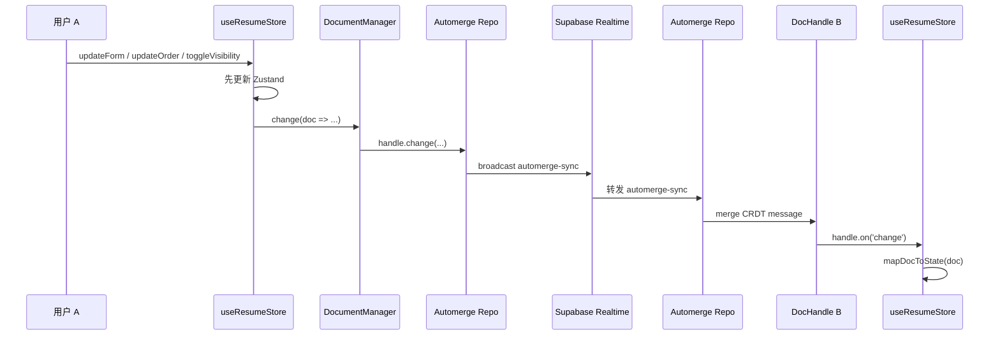
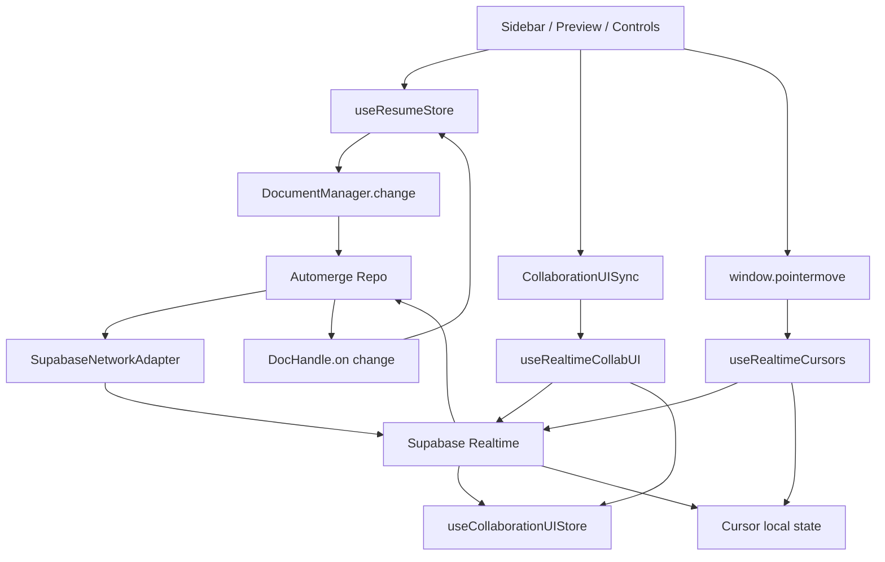
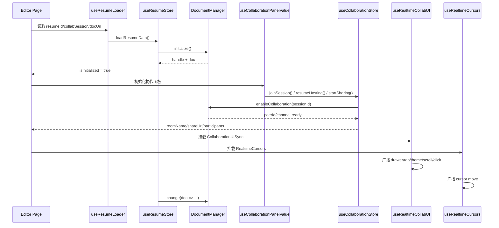

# 实时协作系统实现说明

本文档基于当前代码实现，说明这套系统如何完成以下三类同步：

1. 简历正文的多人实时编辑
2. 编辑器 UI 状态的广播与跟随
3. 远程光标与点击反馈

这份文档不是协同编辑概念介绍，而是对照当前仓库里的真实代码路径展开说明。旧版文档里提到的平铺文件，例如 `src/lib/automerge/document-manager.ts`、`src/lib/collaboration/session-storage.ts`、`src/lib/collaboration/viewport.ts`，都已经被新的分层结构替代。

说明：

- 标记为 `ts` / `tsx` 的代码块，都是补齐了必要上下文后的正规示例。
- 如果只是为了说明一段表达式、返回值或局部逻辑，而不是完整 TypeScript 代码，则统一使用 `text` 代码块，避免 IDE 将其当成可直接运行的源码片段。

## 1. 当前目录结构

现在协作系统分成两组核心模块：

```text
src/lib/automerge/
  collaboration/
    session-manager.ts
    supabase-network-adapter.ts
  document/
    factory.ts
    manager.ts
    persistence.ts
    schema.ts
  repo/
    repo-instance.ts
  shared/
    ...
  index.ts

src/lib/collaboration/
  session/
    callbacks.ts
    service.ts
    state.ts
    storage.ts
    store.ts
    types.ts
    index.ts
  ui/
    channel.ts
    constants.ts
    state.ts
    store.ts
    types.ts
    index.ts
  cursor/
    channel.ts
    constants.ts
    hook.ts
    state.ts
    types.ts
    index.ts
  shared/
    color.ts
    realtime-user.ts
    session.ts
    viewport.ts
    index.ts
  index.ts
```

它们的职责边界是：

| 层         | 位置                              | 负责内容                                                | 不负责内容             |
| ---------- | --------------------------------- | ------------------------------------------------------- | ---------------------- |
| 内容协作层 | `src/lib/automerge/*`             | CRDT 文档、快照加载、Automerge Repo、网络同步、控制消息 | UI 状态、远程鼠标展示  |
| 会话层     | `src/lib/collaboration/session/*` | 开启/加入/恢复/关闭协作，会话状态，参与者列表，分享链接 | 文档存储细节、鼠标轨迹 |
| UI 同步层  | `src/lib/collaboration/ui/*`      | 抽屉、Tab、滚动、主题配置、点击反馈                     | 正文 CRDT 合并         |
| Cursor 层  | `src/lib/collaboration/cursor/*`  | 鼠标位置发送、接收、投影、批量刷新                      | 文档内容、业务配置     |
| 共享工具层 | `src/lib/collaboration/shared/*`  | 房间名、分享链接、颜色、presence userId、视口投影       | 任何业务状态           |

统一导出入口：

- `src/lib/automerge/index.ts`
- `src/lib/collaboration/index.ts`

业务侧现在统一直接从 `@/lib/collaboration` 导入，不再保留兼容旧路径的桥接文件。

## 2. 先看三条同步通道

这套系统不是“一个频道里同步所有东西”，而是明确拆成三条链路：

| 同步内容 | 通道                                  | 触发位置                                                 | 接收后写入位置                      |
| -------- | ------------------------------------- | -------------------------------------------------------- | ----------------------------------- |
| 简历正文 | Supabase Realtime + Automerge message | `src/store/resume/form.ts` -> `DocumentManager.change()` | `DocHandle.on('change')` -> Zustand |
| UI 状态  | Supabase broadcast                    | `src/hooks/use-realtime-collab-ui.ts`                    | `useCollaborationUIStore`           |
| Cursor   | Supabase broadcast                    | `src/lib/collaboration/cursor/hook.ts`                   | React 本地 `cursors` state          |

这三个通道的关键差异是：

- 正文走 CRDT，不直接广播字段值。
- UI 走事件广播，不做 CRDT 合并。
- Cursor 走高频广播，但接收端按帧批量落地，减少抖动和重渲染。

## 3. 编辑器启动后的完整流程

### 3.1 页面入口如何挂载协作能力

编辑器入口在 `src/pages/resume/editor/index.tsx`。它会根据当前会话状态挂载不同的协作能力：

```tsx
import type { RefObject } from 'react'
import type { ORDERType } from '@/lib/schema'
import { Fragment } from 'react'
import { RealtimeCursors } from '@/components/realtime-cursors'
import { CollaborationUISync } from '@/pages/resume/editor/components/collaboration/CollaborationUISync'

interface CollaborationMountProps {
  roomName: string | null
  isSharing: boolean
  currentUser: { id: string } | null
  userDisplayName: string
  drawerOpen: boolean
  setDrawerOpen: (open: boolean) => void
  activeTabId: ORDERType
  onUpdateActiveTabId: (id: ORDERType) => void
  previewScrollRef: RefObject<HTMLDivElement | null>
}

export function CollaborationMounts({
  roomName,
  isSharing,
  currentUser,
  userDisplayName,
  drawerOpen,
  setDrawerOpen,
  activeTabId,
  onUpdateActiveTabId,
  previewScrollRef,
}: CollaborationMountProps) {
  const username = userDisplayName || (currentUser ? `用户-${currentUser.id.slice(0, 6)}` : '匿名用户')

  return (
    <Fragment>
      {roomName && currentUser
        ? <RealtimeCursors roomName={roomName} username={username} />
        : null}

      {roomName && isSharing && currentUser
        ? (
            <CollaborationUISync
              roomName={roomName}
              username={username}
              drawerOpen={drawerOpen}
              setDrawerOpen={setDrawerOpen}
              activeTabId={activeTabId}
              onUpdateActiveTabId={onUpdateActiveTabId}
              scrollContainerRef={previewScrollRef}
            />
          )
        : null}
    </Fragment>
  )
}
```

这里有两个重要点：

1. 远程光标只要求 `roomName` 存在，所以 host 和 guest 都能看到彼此鼠标。
2. UI 同步要求 `isSharing`，说明它只在协作会话激活后才会广播和消费 UI 状态。

### 3.2 `useResumeLoader` 先把文档加载起来

`src/pages/resume/editor/hooks/useResumeLoader.ts` 是页面启动的第一步。它做的事情是：

1. 从 URL 里解析 `resumeId`、`collabSession`、`docUrl`
2. 决定当前要打开哪份简历
3. 调用 `useResumeStore().loadResumeData(activeResumeId, { documentUrl })`
4. 页面卸载时执行：
   - `useResumeStore.getState().cleanup()`
   - `useCollaborationStore.getState().stopSharing({ silent: true })`

也就是说，文档初始化先于会话初始化。这一点很关键，因为协作层依赖 `docManager` 已经可用。

### 3.3 `loadResumeData` 如何接上 `DocumentManager`

`src/store/resume/form.ts` 的 `loadResumeData()` 是正文编辑的实际初始化入口。在线模式下，它会：

1. 创建 `new DocumentManager(resumeId, user.id, { sharedDocumentUrl })`
2. `await manager.initialize()`
3. 拿到 `DocHandle`
4. 监听 `handle.on('change')`
5. 监听 `manager.onSaveStart()` 和 `manager.onSaveResult()`
6. 把当前文档内容映射进 Zustand

核心代码路径：

```ts
import type { AutomergeResumeDocument } from '@/lib/automerge'
import { DocumentManager } from '@/lib/automerge'

type ResumeViewState = Record<string, unknown> & {
  isInitialized: boolean
}

interface BindResumeDocumentOptions {
  resumeId: string
  userId: string
  documentUrl?: string
  setState: (updater: (prev: ResumeViewState) => ResumeViewState) => void
  mapDocToState: (doc: AutomergeResumeDocument) => Record<string, unknown>
}

export async function bindResumeDocument({
  resumeId,
  userId,
  documentUrl,
  setState,
  mapDocToState,
}: BindResumeDocumentOptions) {
  const manager = new DocumentManager(resumeId, userId, {
    sharedDocumentUrl: documentUrl,
  })
  const handle = await manager.initialize()

  handle.on('change', ({ doc }: { doc: AutomergeResumeDocument | null }) => {
    if (!doc) {
      return
    }

    setState(prev => ({
      ...prev,
      ...mapDocToState(doc),
      isInitialized: true,
    }))
  })

  return { manager, handle }
}
```

这一段定义了正文协作的基本事实：

- React UI 实际依赖的是 Zustand store。
- Automerge 文档是多人协作的事实来源。
- `handle.on('change')` 是 CRDT 结果回流到 UI 的桥。

### 3.4 URL 驱动自动加入协作

文档加载完成后，`src/pages/resume/editor/hooks/useCollaborationPanelValue.ts` 会继续根据 URL 判断是否应该自动进入协作会话。

判断条件包括：

- URL 里是否有 `collabSession`
- 文档是否初始化完成
- 当前模式是否为 `online`
- 当前用户是否存在
- 当前用户曾经是不是这个 session 的 host

host/guest 的恢复判断来自：

- `src/lib/collaboration/session/storage.ts`
- `getStoredSessionRole(sessionId, resumeId, userId)`

流程是：

1. 如果 `sessionRoleHint === 'host'`，调用 `resumeHosting(...)`
2. 否则调用 `joinSession(...)`

这意味着刷新页面时不会盲目把原 host 当成 guest。

## 4. 内容协作层：Automerge 是怎么串起来的

这一层的核心目标是：

- 本地编辑立即响应
- 远端修改可以自动合并
- 合并结果能回写 UI 和数据库

### 4.1 本地修改从哪里进入

正文编辑统一从 `src/store/resume/form.ts` 进入，最终都汇聚到 `applyResumeChange(...)`。例如：

- `updateForm`
- `updateOrder`
- `toggleVisibility`
- `setVisibility`
- `changeType`

这些 action 的模式都一致：先改 Zustand，再改 Automerge，再异步持久化。

```text
function applyResumeChange(set, get, stateUpdate, docUpdate?) {
  set((prev) => {
    const updates = typeof stateUpdate === 'function' ? stateUpdate(prev) : stateUpdate
    return { ...updates, pendingChanges: true, syncError: null }
  })

  const freshState = get()

  if (docUpdate) {
    freshState.docManager?.change((doc) => {
      docUpdate(doc)
    })
  }

  scheduleOnlinePersist(() => get().syncToSupabase())
}
```

这里的职责拆分非常清楚：

- Zustand 负责本地即时渲染
- `docManager.change()` 负责进入 CRDT 文档
- `scheduleOnlinePersist()` 负责延时落库

因此它不是“直接把输入框内容写 Supabase”，而是一个三段式模型：

1. 乐观更新
2. CRDT 合并
3. 延时持久化

### 4.2 `DocumentManager` 的定位

`src/lib/automerge/document/manager.ts` 现在只做编排，不再把所有职责堆在一个文件里。

它管理的内容有：

- 当前 `DocHandle`
- 当前 `Repo`
- 当前 `CollaborationSessionManager`
- 保存监听器
- 初始化流程
- `change()` 的统一入口

它不直接自己写所有数据库逻辑，也不自己处理所有网络协议，而是委托给：

- `AutomergeDocumentPersistence`
- `CollaborationSessionManager`

### 4.3 文档初始化如何工作

`DocumentManager.initialize()` 的顺序是：

1. `getAutomergeRepo(this.resumeId)` 获取当前简历专属 Repo
2. 创建 `CollaborationSessionManager`
3. 调用 `this.persistence.loadHandle(repo)`
4. 如果已经有文档，直接 `attachHandle(existingHandle)`
5. 如果没有现成文档：
   - `loadResumeConfig()`
   - `createResumeDocument({ repo, resumeId, userId, seedData })`
   - `attachHandle(handle)`
   - 如果允许持久化，先尝试写一次快照到 Supabase

关键代码：

```text
const existingHandle = await this.persistence.loadHandle(repo)
if (existingHandle) {
  return this.attachHandle(existingHandle)
}

const seedData = await this.persistence.loadResumeConfig()
const handle = await createResumeDocument({
  repo,
  resumeId: this.resumeId,
  userId: this.userId,
  seedData,
})
```

### 4.4 `factory.ts` 如何创建初始文档

`src/lib/automerge/document/factory.ts` 负责文档的“出生过程”，包括：

- 设置 `_metadata`
- 合并业务层种子数据
- 补齐 `order`
- 补齐 `visibility`
- 生成确定性的 actor

```text
const handle = repo.create<AutomergeResumeDocument>({
  actor: generateDeterministicActor(resumeId),
})

handle.change((doc) => {
  doc._metadata = buildMetadata(undefined, { resumeId, userId })
  if (seedData)
    Object.assign(doc, seedData)
  if (!doc.order || doc.order.length === 0) {
    doc.order = [...DEFAULT_ORDER]
  }
  if (!doc.visibility) {
    doc.visibility = { ...DEFAULT_VISIBILITY }
  }
})
```

这里 `_metadata` 很重要，因为后续每次 `DocumentManager.change()` 都会调用 `touchDocumentMetadata()`，更新：

- `updatedAt`
- `version`

### 4.5 数据持久化为什么拆成 `persistence.ts`

`src/lib/automerge/document/persistence.ts` 负责所有快照读取与写入，不再让 `DocumentManager` 直接承担数据库细节。

#### 读取策略

`loadHandle(repo)` 的逻辑是：

1. 如果分享链接带了 `sharedDocumentUrl`，优先 `repo.find(documentUrl)`
2. 找不到再去查 `automerge_documents`
3. 如果 `metadata.documentUrl` 存在，再次尝试 `repo.find(metadataDocumentUrl)`
4. 如果还不行，就把数据库里的二进制 `document_data` 做 `repo.import(bytes)`

#### 写入策略

`saveHandle(handle)` 会写入 `automerge_documents`：

- `document_data`
- `heads`
- `document_version`
- `metadata.documentUrl`
- `metadata.docMetadata`

#### 为什么 `sharedDocumentUrl` 会关闭持久化

构造函数里有这样一个判断：

```text
this.canPersistToSupabase = !sharedDocumentUrl
```

这表示：如果当前页面是通过分享链接里的 `docUrl` 直接接入文档，那么这一端默认不主动把快照写回 Supabase。这样能避免 guest 侧基于共享文档 URL 直接覆盖服务端快照。

### 4.6 Repo 为什么要按简历切换重建

`src/lib/automerge/repo/repo-instance.ts` 维护单例 Repo，但会在切换到另一份简历时主动销毁旧实例：

```text
if (repoInstance && resumeId && activeResumeId && activeResumeId !== resumeId) {
  destroyAutomergeRepo()
}
```

目的不是节省对象创建，而是避免上一份简历残留的网络 adapter、连接状态和文档引用继续污染新会话。

### 4.7 开启协作时，内容协作链路如何接通

会话入口在 `src/lib/collaboration/session/store.ts`。host 开启协作时：

```text
await activateSession({
  sessionId: createCollaborationSessionId(),
  resumeId,
  userId,
  userName,
  role: 'host',
  shouldSaveSnapshot: true,
}, { get, set })
```

`activateSession()` 再调用 `enableCollaborationSession()`，后者做这些事：

1. 取出 `docManager`
2. 生成当前用户颜色
3. 构造 `createSessionCallbacks(...)`
4. `await docManager.enableCollaboration(sessionId, callbacks)`
5. 如果是 host 且需要，先 `saveToSupabase()`
6. 产出：
   - `shareUrl`
   - `roomName`
   - `selfPeerId`

`shareUrl` 来自 `src/lib/collaboration/shared/session.ts`：

```ts
export function buildExampleShareUrl(
  origin: string,
  resumeId: string,
  sessionId: string,
  documentUrl?: string,
) {
  const url = new URL('/resume/editor', origin)
  url.searchParams.set('resumeId', resumeId)
  url.searchParams.set('collabSession', sessionId)

  if (documentUrl) {
    url.searchParams.set('docUrl', documentUrl)
  }

  return url.toString()
}
```

也就是说，当前分享链接包含三类信息：

- 要打开哪份简历
- 要加入哪个协作 session
- 如果有共享文档 URL，就直接指向那份 Automerge 文档

### 4.8 `CollaborationSessionManager` 只负责 adapter 生命周期

`src/lib/automerge/collaboration/session-manager.ts` 的职责很单一：

1. 创建 `SupabaseNetworkAdapter`
2. 把 adapter 挂到 `repo.networkSubsystem`
3. 用 `syncHandle()` 告诉 adapter 当前本地文档 id
4. 切 session 时销毁旧 adapter

它不关心 UI，也不关心业务表结构。

### 4.9 `SupabaseNetworkAdapter` 才是正文同步的网络桥

`src/lib/automerge/collaboration/supabase-network-adapter.ts` 负责把 Automerge Repo 的消息映射到 Supabase Realtime。

频道命名规则：

```text
this.channelName = `automerge:resume:${resumeId}:${sessionId}`
```

这和 UI/cursor 使用的 `roomName` 不是一回事。正文同步使用独立频道，避免高频 UI 消息干扰 CRDT 消息。

它负责三类事件：

1. `automerge-sync`
2. `automerge-control`
3. `presence join/leave`

#### 发送正文消息

当 Repo 需要发消息时，adapter 的 `send(message)` 会把二进制数据编码成 base64 后广播：

```text
this.channel.send({
  type: 'broadcast',
  event: 'automerge-sync',
  payload: {
    senderId: this.peerId,
    targetId: message.targetId,
    messageType: message.type,
    documentId: ...,
    message: encodeBytesToBase64(message.data),
    sessionId: this.sessionId,
  },
})
```

#### 接收正文消息

接收到 `automerge-sync` 后，adapter 不会立刻盲目发给 Repo，而是先判断本地是否已经知道 `documentId`：

- 如果本地 `localDocumentId` 还没准备好，先进入 `pendingMessages`
- 等 `setLocalDocumentId()` 后再 `flushPendingMessages()`

这一步解决的是“网络消息先到了，但本地文档句柄还没 attach”的时序问题。

#### 接收控制消息

`automerge-control` 用来发会话控制事件，比如 host 关闭协作时的 `share-ended`。这一类消息不进 CRDT，而是走 `callbacks.onControlMessage`。

### 4.10 参与者列表是怎么更新的

会话层通过 `createSessionCallbacks()` 注入 adapter 回调，位置在 `src/lib/collaboration/session/callbacks.ts`。

它把 peer 事件映射成业务可用的 session store 更新：

- `onChannelReady` -> 记录 `channelName`
- `onPeerJoin` -> `addParticipant(...)`
- `onPeerLeave` -> `removeParticipant(...)`
- `onControlMessage('share-ended')` -> guest 执行 `handleRemoteShareEnd()`

注意这里的参与者 key 是 `peerId`，不是 Supabase 用户 id。

## 5. 从一端输入到另一端看到内容变化的完整链路

下面是正文编辑的真实时序：



这条链路里，真正的“内容一致性保证”来自 Automerge merge，而不是来自双方自己约定字段覆盖顺序。

## 6. UI 同步层：为什么单独拆出来

UI 状态不是正文内容，但会明显影响协作体验。例如：

- 抽屉开关
- 当前 Tab
- 主题、字体、间距配置
- 当前滚动位置
- 鼠标点击反馈

如果把这些也塞进 Automerge 文档，会有两个问题：

1. 这些状态更新频率高、临时性强，不适合写入业务文档。
2. 跟随行为需要的是事件和即时广播，不是 CRDT 历史合并。

所以现在单独拆成 `src/lib/collaboration/ui/*`。

### 6.1 UI 通道命名

`src/lib/collaboration/ui/channel.ts` 里：

```ts
const COLLAB_UI_CHANNEL_SUFFIX = 'ui'

export function buildCollaborationRoomName(resumeId: string, sessionId: string) {
  return `resume-collab:${resumeId}:${sessionId}`
}

export function buildCollaborationUIChannelName(roomName: string) {
  return `${roomName}:${COLLAB_UI_CHANNEL_SUFFIX}`
}
```

所以 UI 通道实际长这样：

```text
resume-collab:<resumeId>:<sessionId>:ui
```

### 6.2 UI 广播分成三类 payload

`src/lib/collaboration/ui/types.ts` 定义了三类消息：

1. `UIStateBroadcastPayload`
2. `UIActionBroadcastPayload`
3. `ClickEventBroadcastPayload`

它们分别承担不同职责：

| 类型   | 目的                                   | 是否持有语义 |
| ------ | -------------------------------------- | ------------ |
| state  | 描述一个用户当前 UI 快照               | 是           |
| action | 描述某次行为，例如切 tab、滚动、改主题 | 是           |
| click  | 只用于提示用户“别人刚刚点了这里”       | 否           |

### 6.3 `useRealtimeCollabUI` 如何组织 UI 通信

`src/hooks/use-realtime-collab-ui.ts` 是 UI 层真正的编排 hook。

它会：

1. 生成本地 `userId`
2. 生成本地展示颜色
3. 建立 Supabase channel
4. 绑定广播回调
5. 订阅成功后 track presence
6. 立即广播一次当前 UI 状态
7. 监听全局 click 事件并广播点击位置
8. 卸载时 reset UI store

本地状态广播入口：

```ts
import type { RealtimeChannel } from '@supabase/supabase-js'
import type { CollaborationUIIdentity, SharedUIConfig } from '@/lib/collaboration'
import type { ORDERType } from '@/lib/schema'
import { COLLAB_UI_STATE_EVENT, createUIStatePayload } from '@/lib/collaboration'

interface BroadcastUIStateOptions {
  channel: RealtimeChannel | null
  identity: CollaborationUIIdentity
  drawerOpen: boolean
  activeTabId: ORDERType | null
  config?: SharedUIConfig
  getScrollPosition?: () => number
}

export function broadcastCurrentUIState({
  channel,
  identity,
  drawerOpen,
  activeTabId,
  config,
  getScrollPosition,
}: BroadcastUIStateOptions) {
  if (!channel) {
    return
  }

  channel.send({
    type: 'broadcast',
    event: COLLAB_UI_STATE_EVENT,
    payload: createUIStatePayload({
      identity,
      drawerOpen,
      activeTabId,
      config,
      getScrollPosition,
    }),
  })
}
```

### 6.4 接收 UI 消息后落到哪里

`bindCollaborationUIChannel(...)` 会把消息落到 `useCollaborationUIStore` 暴露的 action 上：

- `onRemoteState` -> `updateRemoteUIState`
- `onRemoteAction` -> `setLatestRemoteAction`
- `onRemoteClick` -> `addRemoteClick`
- `onRemoteUserLeave` -> `removeRemoteUser`

这意味着 UI 层不是直接在 channel 回调里改组件 state，而是先进入专用 UI store。

### 6.5 `CollaborationUISync` 如何把远程动作应用到本地

`src/pages/resume/editor/components/collaboration/CollaborationUISync.tsx` 是 UI 同步和页面实际 UI 之间的桥。

它做两件相反方向的事：

#### 本地 -> 远程

监听这些本地变化并广播：

- `drawerOpen`
- `activeTabId`
- `spacing`
- `font`
- `theme`
- `scroll`

例如滚动同步使用了节流：

```text
const broadcastScroll = useThrottledCallback((target: ScrollTarget) => {
  if (isApplyingRemote.current || shouldIgnoreScrollSync()) return
  broadcastUIAction({
    kind: 'scroll',
    position: getScrollPositionByTarget(target),
    target,
  })
}, 80, ...)
```

#### 远程 -> 本地

当 `followMode` 开启时，消费 `latestRemoteAction`，并把动作反向应用到当前页面：

- 打开/关闭抽屉
- 切换 Tab
- 更新 spacing/font/theme
- 滚动到远端位置

为了防止“收到远程动作 -> 本地更新 -> 又广播出去”的循环，它用了 `isApplyingRemote` 和 `suppressScrollSync()` 两层保护。

### 6.6 点击波纹为什么不需要长期保存

点击反馈只是一种感知增强，不是状态事实，所以 `useCollaborationUIStore` 会在 `CLICK_EXPIRE_MS` 后自动清理：

- 过期时间定义在 `src/lib/collaboration/ui/constants.ts`
- 清理调度逻辑在 `src/lib/collaboration/ui/store.ts`

因此远程点击只会短暂显示，不会像正文一样长期存档。

## 7. Cursor 层：为什么现在单独拆成 `cursor/`

Cursor 是一条独立的高频同步链路，和正文、UI 都不同：

- 发送频率更高
- 只关心当前位置
- 对“平滑感”要求更高
- 不能每来一个包就立刻触发一次 React setState

所以它现在独立放在 `src/lib/collaboration/cursor/*`。

### 7.1 Cursor 用的频道

Cursor 直接复用 `roomName` 本身：

```text
const channel = supabase.channel(roomName)
```

这意味着：

- UI 通道是 `${roomName}:ui`
- Cursor 通道是 `roomName`
- 正文通道是 `automerge:resume:${resumeId}:${sessionId}`

三者彻底分离。

### 7.2 本地鼠标如何发送

`src/lib/collaboration/cursor/hook.ts` 的发送链路是：

1. 监听 `window.pointermove`
2. 把最新坐标写到 `latestPointerPositionRef`
3. 用 `requestAnimationFrame` 调度发送
4. 在帧回调里检查 `throttleMs`
5. 构造 payload 并广播

核心逻辑：

```text
const handlePointerMove = useCallback((event: PointerEvent) => {
  latestPointerPositionRef.current = {
    x: event.clientX,
    y: event.clientY,
  }
  scheduleOutgoingCursorFlush()
}, [])

const flushOutgoingCursor = useCallback((frameTime: number) => {
  const latestPosition = latestPointerPositionRef.current
  if (!latestPosition)
    return

  if (frameTime - lastSentAtRef.current < throttleMs) {
    sendFrameRef.current = requestAnimationFrame((nextFrameTime) => {
      flushOutgoingCursorRef.current(nextFrameTime)
    })
    return
  }

  const payload = createCursorPayload({
    position: latestPosition,
    viewport: getViewportSize(),
    userId,
    username,
    color,
  })

  cursorPayloadRef.current = payload
  latestPointerPositionRef.current = null
  lastSentAtRef.current = frameTime
  broadcastCursorPayload(channelRef.current, payload)
}, [throttleMs, userId, username, color])
```

这段代码有两个非常重要的设计：

1. 只发送“最新点”，不会把一帧内所有 pointermove 全发出去。
2. 节流检查发生在 `requestAnimationFrame` 回调里，而不是直接在 DOM 事件里。

`src/components/realtime-cursors.tsx` 当前把 `throttleMs` 设为 `12`，接近 60fps 节奏：

```text
const THROTTLE_MS = 12
const { cursors } = useRealtimeCursors({ roomName, username, throttleMs: THROTTLE_MS })
```

### 7.3 远端鼠标如何接收

接收端同样没有“来一条包就立刻 setState”，而是先放进 `pendingRemoteCursorsRef`，再一帧统一 flush：

```text
onRemoteCursor: (payload) => {
  pendingRemoteCursorsRef.current[payload.user.id] = projectRealtimeCursor(
    payload,
    (point, viewport) => projectPointToViewport(point, viewport),
  )
  scheduleRemoteCursorFlush()
}
```

然后在下一帧里：

```text
const batch = Object.values(pendingRemoteCursorsRef.current)
pendingRemoteCursorsRef.current = {}
setCursors(prev => upsertRealtimeCursorBatch(prev, batch))
```

这样做的直接收益是：

- 高频网络消息不会把 React 渲染频率拖爆
- 同一帧内来自多个用户的 cursor 更新可以合并处理
- 远端视觉会比“每包一次 setState”更稳定

### 7.4 为什么要做视口投影

不同协作者的屏幕尺寸可能不同。如果直接使用对方的原始 `clientX/clientY`，鼠标会落在错误位置。

因此每个 cursor payload 都会带上发送端 viewport：

```text
viewport: getViewportSize()
```

接收端再调用 `projectPointToViewport()`：

```ts
interface ViewportPoint {
  x: number
  y: number
}

interface ViewportSize {
  width: number
  height: number
}

export function projectPointToViewport(
  point: ViewportPoint,
  sourceViewport: ViewportSize | undefined,
  targetViewport: ViewportSize,
): ViewportPoint {
  if (!sourceViewport?.width || !sourceViewport?.height) {
    return point
  }

  return {
    x: (point.x / sourceViewport.width) * targetViewport.width,
    y: (point.y / sourceViewport.height) * targetViewport.height,
  }
}
```

UI 点击波纹也用了同一套投影逻辑。

### 7.5 为什么画面上看起来是平滑的

`src/components/cursor.tsx` 没有直接把点位塞进 style，而是通过 `usePerfectCursor()` 做插值平滑。

```text
const moveCursor = usePerfectCursor(animateCursor)

useLayoutEffect(() => {
  moveCursor([point.x, point.y])
}, [moveCursor, point.x, point.y])
```

`src/hooks/use-perfect-cursor.ts` 内部用的是 `perfect-cursors`：

```text
PerfectCursor.MAX_INTERVAL = 1
cursorRef.current = new PerfectCursor(point => callbackRef.current(point))
```

所以视觉上的平滑来自三层组合：

1. 发送端按帧发送最新点
2. 接收端按帧批量落地
3. 渲染端用 `perfect-cursors` 做轨迹插值

### 7.6 新用户加入时为什么能立刻看到鼠标

Cursor channel 监听了 `presence join`。一旦有新 peer 进入，如果本端已经有最近一次 cursor payload，就会立刻重发一次：

```text
onPeerJoin: () => {
  if (!cursorPayloadRef.current)
    return
  broadcastCursorPayload(channelRef.current, cursorPayloadRef.current)
}
```

这样新加入的人不需要等对方再次移动鼠标，马上就能看到当前位置。

## 8. UI、Cursor、正文三层之间如何配合

下面这张图能更清楚地看出三条链路的关系：



如果把这三层混在一起，后续扩展会很痛苦。现在分层后，每层都可以单独替换协议或行为，而不用同时改动所有逻辑。

## 9. 会话层：开启、加入、恢复、关闭

### 9.1 开启协作

`src/lib/collaboration/session/store.ts` 中的 `startSharing()` 负责 host 发起协作。流程是：

1. 如果已存在旧 session，先 `stopSharing({ silent: true })`
2. 生成新的 `sessionId`
3. 调用 `activateSession(...)`
4. 成功后 toast 提示

### 9.2 加入协作

`joinSession()` 不会重新生成 sessionId，而是使用分享链接里现成的 `sessionId`。它同样走 `activateSession(...)`，但 role 是 `guest`，且：

```text
shouldSaveSnapshot: false
```

也就是说，guest 加入时不会主动触发快照保存。

### 9.3 恢复 host

刷新页面后，如果 `sessionStorage` 里记录当前用户曾是 host，则 `useCollaborationPanelValue.ts` 会调用 `resumeHosting()` 而不是 `joinSession()`。

这个行为保证了：

- host 刷新后仍然是 host
- 不会把 host 错误降级成 guest

### 9.4 关闭协作

当 host 主动关闭协作时，`stopSharing()` 会执行：

```text
if (state.role === 'host' && state.sessionId && docManager) {
  docManager.broadcastCollaborationEvent('share-ended', { reason: 'host_closed' })
}

docManager?.disableCollaboration()
clearStoredSession(...)
set(createStoppedSessionState(state))
```

guest 收到 `share-ended` 后，会在 `handleRemoteShareEnd()` 中：

1. `docManager.disableCollaboration()`
2. 清理 sessionStorage
3. 把 `shareEndedByRemote` 设为 `true`
4. 由 `useCollaborationPanelValue.ts` 监听后跳回 `/resume`

## 10. 持久化、恢复和容错

### 10.1 持久化分成两张表

这套系统使用两类数据表：

#### `resume_config`

面向业务层，存的是最终简历内容，便于普通读取、列表展示、非协作场景恢复。

#### `automerge_documents`

面向协作层，存的是：

- Automerge 二进制快照
- heads
- document metadata
- `documentUrl`

二者关系是：

- `automerge_documents` 负责协作过程中的 CRDT 快照
- `resume_config` 负责最终业务数据展示和普通编辑读取

### 10.2 为什么在线同步时要同时写两处

`src/store/resume/form.ts` 的 `syncToSupabase()` 在线模式下会：

1. `await state.docManager.saveToSupabase(state.docHandle)`
2. 从 `state.docHandle.doc()` 取出冲突解决后的最终文档
3. `await updateResumeConfig(resumeId, resolvedFormData)`

这里的顺序是有意义的：

- 先保存 CRDT 快照，保证协作态可恢复
- 再把 merge 后的最终结果写回业务表

### 10.3 权限和不可持久化场景

`AutomergeDocumentPersistence` 里一旦遇到这些情况，会关闭继续持久化：

- 通过分享链接加载了 `sharedDocumentUrl`
- 读取或写入返回权限错误，例如 `42501` / `403`
- `resume_config` 查询不到数据

这套设计避免了在没有可靠持久化能力时继续写库导致报错连锁。

### 10.4 会话角色为什么放 `sessionStorage`

`src/lib/collaboration/session/storage.ts` 只存很小的一份状态：

- `sessionId`
- `resumeId`
- `userId`
- `role`

目的是在刷新页面时恢复“我原来是 host 还是 guest”。它不承担任何正文或 UI 数据恢复职责。

## 11. 一次真实协作会话的完整时序



## 12. 当前设计的扩展点

现在的结构已经比较适合继续扩展。后面如果要新增能力，建议沿着现有边界做：

### 12.1 新增会话控制事件

例如：

- host 临时锁定编辑
- 只读模式
- 指定跟随某个协作者

建议接入位置：

- `src/lib/automerge/collaboration/supabase-network-adapter.ts`
- `src/lib/collaboration/session/callbacks.ts`

### 12.2 新增 UI 协作类型

例如：

- 选中某个模块高亮
- 远程打开某个弹窗
- 标记“我正在编辑这一段”

建议接入位置：

- `src/lib/collaboration/ui/types.ts`
- `src/lib/collaboration/ui/channel.ts`
- `src/pages/resume/editor/components/collaboration/CollaborationUISync.tsx`

### 12.3 新增 cursor 元信息

例如：

- 当前正在拖拽
- 当前处于文本选择态
- 当前聚焦的区域

建议接入位置：

- `src/lib/collaboration/cursor/types.ts`
- `src/lib/collaboration/cursor/channel.ts`
- `src/components/cursor.tsx`

### 12.4 替换存储后端

如果后续不再用 Supabase 存快照，只需要重点替换：

- `src/lib/automerge/document/persistence.ts`

而不会影响 UI sync、cursor sync、session store 的结构。

## 13. 总结：这套系统现在的职责边界

用一句话概括当前实现：

- `useResumeStore` 负责编辑器正文状态
- `DocumentManager` 负责 Automerge 文档编排
- `SupabaseNetworkAdapter` 负责正文 CRDT 消息通道
- `useCollaborationStore` 负责会话状态和参与者
- `useRealtimeCollabUI` + `useCollaborationUIStore` 负责 UI 广播与跟随
- `useRealtimeCursors` 负责高频 cursor 同步
- `RealtimeCursors` / `Cursor` 负责远端鼠标的最终呈现

这也是这次分层重构后最重要的收益：每一层都只处理自己该处理的东西，阅读、定位问题和继续扩展都会比之前的平铺实现清晰得多。
